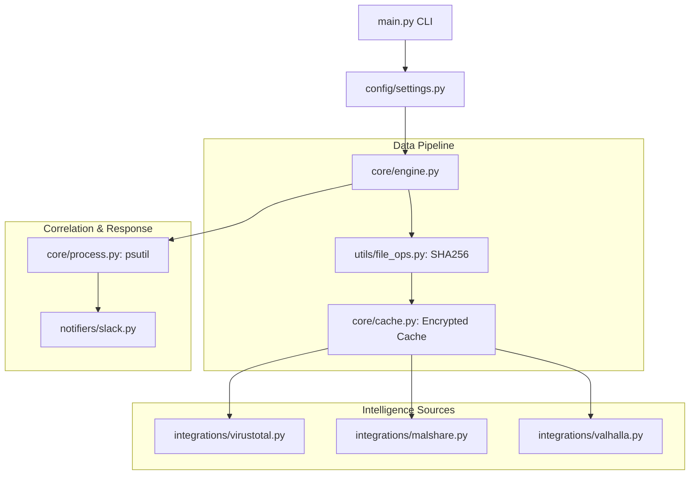

# 🛡️ Enterprise VirusTotal Scanner
**A Modular Threat Intelligence & OS Correlation Engine**

[](https://www.python.org/downloads/release/python-3120/)
[](https://opensource.org/licenses/MIT)
[](https://github.com/Namanbhatt-01)

VirusTotal Scanner is a high-performance, modular security tool designed for local file triage and process correlation. Unlike simple scripts, this project implements a production-grade architecture to monitor file systems, query multi-source Threat Intelligence (TI), and deliver actionable alerts via Enterprise Slack Webhooks.

---

## 🏗️ Architecture Overview

The project follows a **Modular Domain Architecture**, separating the scanning engine from API integrations and alerting logic.



---

## 💎 Security Engineering Highlights

This project was built to demonstrate senior-level security engineering competencies:

*   **Modular Extensibility:** Built using a plugin-style architecture. Adding a new TI source (like CrowdStrike or AlienVault) requires zero changes to the core engine.
*   **Encrypted Local State:** Scan history is stored in an **AES-256 encrypted cache** (`history.cache`). This ensures that malware cannot tamper with the scanner's memory or "whitelist" itself by editing the local history.
*   **Resource Efficiency:** Implements **chunked binary reading** for file hashing. This allows the scanner to process 20GB+ files on low-resource systems (like an 8GB M1 Mac) without memory exhaustion.
*   **Operational Integrity:** Uses **Pydantic** for strict type-validation of environment variables and API payloads, preventing common runtime failures in automated environments.
*   **OS Correlation:** Beyond simple hash matching, the tool correlations files with active system processes, identifying if a malicious binary is currently executing in memory.

---

## 🚀 Deployment & Installation

### 1. Prerequisites
*   Python 3.11+
*   VirusTotal API Key (Free tier)
*   Slack Incoming Webhook URL

### 2. Setup
```bash
# Clone and enter the repository
git clone https://github.com/Namanbhatt-01/VirusTotal_Scanner.git
cd VirusTotal_Scanner

# Create and activate a virtual environment
python -m venv venv
source venv/bin/activate  # On Windows use: venv\Scripts\activate

# Install dependencies
pip install -r requirements.txt
```

### 3. Configuration
Create a `.env` file in the root directory:
```env
VT_API_KEY=your_virustotal_api_key
SLACK_WEBHOOK_URL=https://hooks.slack.com/services/YOUR/WEBHOOK/URL
```

---

## 🛠️ Usage & Demo

### Basic Scan
Scan a specific file or directory:
```bash
python main.py -p ./downloads
```

### Professional Demo (The "Catch")
To demonstrate the tool's effectiveness during an interview:
1.  Start the scanner on a test folder: `python main.py -p ./scans`
2.  Download the [EICAR Test File](https://www.eicar.org/?page_id=3950).
3.  Move the file into `./scans`.
4.  **Result:** Observe an instantaneous **Malicious File Alert** in your Slack channel.

### CLI Arguments & Operations
The scanner supports several advanced flags to customize its behavior:

| Flag | Description | Default |
| :--- | :--- | :--- |
| `-p`, `--paths` | List of folders/files to monitor | Required |
| `-i`, `--stop_interval` | Wait time between scan cycles (minutes) | `0.0` |
| `-f`, `--cycles` | Number of cycles to run (`0` for infinite) | `0` |
| `-w`, `--slack_webhook` | Override Slack Webhook URL | From `.env` |
| `--no_upload` | Skip uploading unknown files to VT | `True` |
| `--debug` | Enable verbose logging for troubleshooting | `False` |

**Example: Production Monitoring**
```bash
python main.py -p /var/log /home/user/downloads -i 15 --cycles 0
```
*This command monitors two sensitive directories every 15 minutes indefinitely.*

---

## 🧠 Design Philosophy: Why This Architecture?

A common mistake in security scripting is writing "Spaghetti Code" (one long file). This project was engineered with a **Modular Design Pattern** for three specific reasons:

1.  **Separation of Concerns:** The Engine (`core/`) doesn't care *where* the data comes from or *how* the alert is sent. This allows you to swap Slack for Microsoft Teams or VirusTotal for CrowdStrike by only changing one isolated file.
2.  **Resilience:** If the VirusTotal API goes down, the local **Encrypted Cache** and **Valhalla/MalShare** integrations continue to provide value. The system is designed to fail gracefully.
3.  **Testability:** Each module (Hashing, API, Logging) can be tested independently, which is a requirement for any tool used in a real SOC environment.

---

## 🚀 Future Roadmap: What's Next?
This project is continuously evolving. Planned future enhancements include:
*   **[ ] Automated Quarantine:** Automatically move malicious files to a restricted directory with `000` permissions.
*   **[ ] YARA Integration:** Add signature-based scanning for detecting unknown malware patterns.
*   **[ ] Web Dashboard:** A Streamlit-based UI for visualizing global scan statistics and threat trends.
*   **[ ] SIEM Export:** Native integration with Splunk (HEC) and Wazuh (Agent-based) for enterprise SOC environments.

---

## 🕵️ Interview FAQ (Security Engineering Deep-Dive)

**Q: Why use SHA-256 instead of MD5?**
> *A: MD5 is vulnerable to collision attacks where two different files can have the same hash. SHA-256 is the current industry standard for cryptographic file integrity and is what most Threat Intel platforms use for indexing.*

**Q: How do you handle API Rate Limits?**
> *A: I implemented a `scan_interval` and a local `history.cache`. By "remembering" what we have already scanned, we avoid redundant API calls, preserving our quota and staying within the Free Tier limits.*

**Q: Why use AES-256 for the local cache? Does it prevent tampering?**
> *A: To be precise, AES-256 ensures **confidentiality**, preventing trivial inspection or modification of the scan history by unauthorized users or malware. While it doesn't prevent a malicious process from deleting the file entirely, it raises the bar for "Anti-Forensics." For absolute integrity, this could be extended with HMAC or signed records.*

**Q: Why did you choose flat-files instead of a database like PostgreSQL?**
> *A: I chose a **Hybrid Storage Model** (Encrypted Cache + JSON Logs). I intentionally avoided external database dependencies to keep the tool portable and minimize its forensic footprint. This allows it to run in potentially compromised environments without requiring installation, open ports, or additional services.*

**Q: What happens if a 50GB file is scanned?**
> *A: The script uses **chunked binary reading**. It only loads 64KB of the file into RAM at a time to calculate the hash, ensuring the scanner remains stable even on low-memory systems.*

---

## 📚 References & Resources

*   [VirusTotal API v3 Documentation](https://docs.virustotal.com/reference/overview)
*   [Slack Incoming Webhooks Guide](https://api.slack.com/messaging/webhooks)
*   [EICAR Standard Anti-Malware Test File](https://www.eicar.org/)
*   [Python Pydantic Documentation](https://docs.pydantic.dev/latest/)

---

## 📊 Technical Stack
*   **Logic:** Python 3 (Object-Oriented)
*   **Validation:** Pydantic (Type-Safety)
*   **Networking:** Requests (REST API Integration)
*   **OS/Forensics:** Psutil (Process Correlation)
*   **Cryptography:** PyCryptodome (AES-256)
*   **Alerting:** Slack Webhooks (Enterprise Notifications)

---

## 📄 License
This project is licensed under the MIT License - see the [LICENSE](LICENSE) file for details.

Developed with 🛡️ by **Naman Bhatt**.